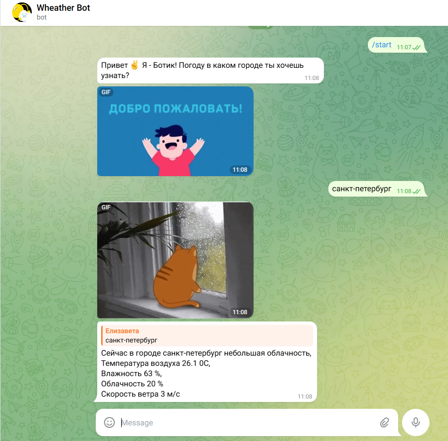

# WeatherBot — Telegram-бот прогноза погоды 

Простой Telegram-бот,который по запросу показывает актуальную погоду в выбранном городе. В ответ пользователь получает
краткий прогноз + забавную гифку согласно погоде. 

## Что умеет

- показывает погоду по названию города
- выводит температуру, облачность, ветер, влажность и дату

## Стек

- Python 3.10
- python-telegram-bot
- requests
- dotenv

## Пример работы
